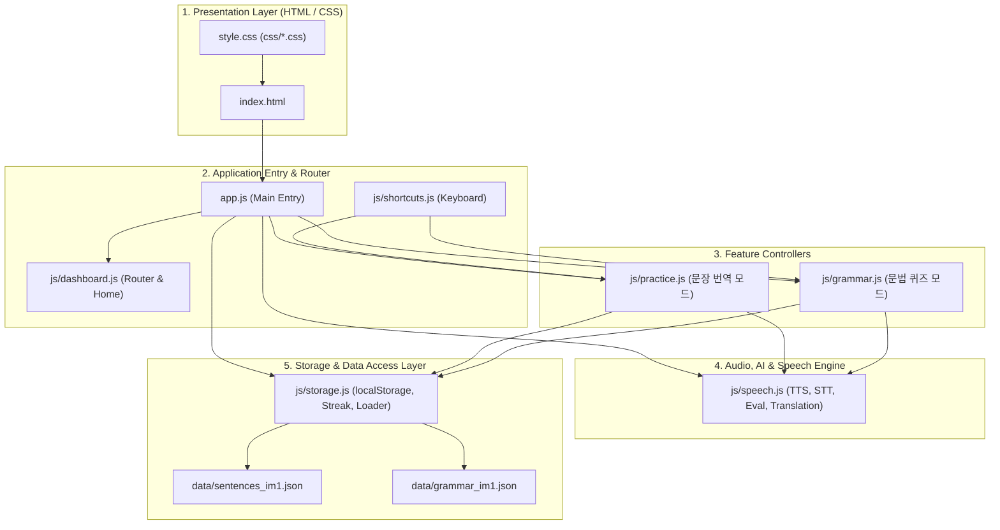

# 🗺️ OPIc 학습 웹 앱 - 코드 맵 (Code Map)

본 문서는 OPIc IM1 대비 **한→영 문장 변환 연습 및 문법 포인트 퀴즈 웹 애플리케이션**의 전체 구조, 파일별 역할, 데이터 흐름 및 아키텍처를 정리한 코드 맵입니다.

---

## 📁 1. 전체 디렉터리 구조 (Directory Tree)

```
OPIc/
├── index.html                  # [View] 메인 HTML 마크업 (화면 컨테이너 및 모듈 로드)
├── style.css                   # [Style] 메인 통합 스타일시트 (@import 모듈 번들러)
├── app.js                      # [Main] 메인 진입점 (이벤트 리스너 등록 & 앱 초기화)
├── CODEMAP.md                  # [Doc] 전체 코드 구조 및 아키텍처 맵
│
├── data/                       # ── [Data Layer] ──────────────────────────
│   ├── sentences_im1.json      # OPIc IM1 문장 번역 데이터 (208개 문항)
│   └── grammar_im1.json        # OPIc IM1 문법 포인트 퀴즈 데이터 (81개 문항)
│
├── js/                         # ── [Logic & Controller Layer] ────────────
│   ├── storage.js              # 스토리지(localStorage), JSON 비동기 로딩, 스트릭/로그
│   ├── speech.js               # Web Speech TTS/STT, 발음 일치도 평가, 실시간 번역, AI 팝업
│   ├── dashboard.js            # DOM 엘리먼트 캐시, 홈 대시보드 통계/차트, 주제 선택 화면
│   ├── practice.js             # 문장 번역 연습 모드 (카드 렌더링, 정답 확인, 채점, 저장)
│   ├── grammar.js              # 문법 포인트 퀴즈 모드 (보기 선택, 해설, 저장)
│   └── shortcuts.js            # 맥북/PC 데스크톱 키보드 단축키 핸들러
│
└── css/                        # ── [Design System & Style Layer] ─────────
    ├── base.css                # 디자인 토큰(CSS 변수), 리셋, 기본 카드 및 반응형 미디어 쿼리
    ├── buttons.css             # 통합 버튼 시스템 (Tier 1~5, 칩, 단축키 배지, 펄스 애니메이션)
    ├── dashboard.css           # 홈 화면 통계 카드, 7일 학습 막대 차트, 주제 선택 그룹 카드
    ├── practice.css            # 문장 연습 입력창, 마이크, 모범답안, 일치도 평가, 문법 검사 박스
    └── grammar.css             # 문법 퀴즈 보기 옵션 카드, 번호 배지, 해설 박스
```

---

## 🏗️ 2. 아키텍처 계층 다이어그램 (Architecture Overview)



---

## 📄 3. 파일별 상세 레퍼런스 (File Reference)

### 🔹 index.html
- **역할**: 단일 페이지 애플리케이션(SPA) 뷰 컨테이너
- **주요 화면 섹션**:
  - `#homeScreen`: 오늘 학습량, 7일간 막대 그래프, 연속 학습일(Streak), 2개 학습 모드 진입 카드
  - `#topicScreen`: 문장 번역 주제 선택 화면 (대분류 카드 그리드)
  - `#practiceCard`: 문장 번역 연습 카드 (한국어 문제, 음성 입력, 모범 답안, 발음 일치도, 문법 피드백)
  - `#doneScreen`: 문장 번역 세트 완료 및 틀린 문제 다시 풀기
  - `#wordTopicScreen`: 문법 퀴즈 유형 선택 화면
  - `#wordCard`: 문법 퀴즈 카드 (빈칸 문장, 1~4번 보기 옵션, 즉시 해설)
  - `#wordDoneScreen`: 문법 퀴즈 세트 완료 화면

---

### 🔹 app.js
- **역할**: 애플리케이션 진입점 및 이벤트 리스너 오케스트레이션
- **주요 로직**:
  - 클립보드 복사 (`copyKo`, `copyEn`, `copyInput`)
  - 실시간 영한 번역 디바운스 입력 리스너 (`userInput`)
  - Google AI 사이드 팝업창 연동 (`googleAskLink`, `wordGoogleAskLink`)
  - TTS 발음 버튼 바인딩 (`ttsKoBtn`, `ttsEnBtn`, `ttsWordBtn`)
  - 문장 연습 & 문법 퀴즈 조작 버튼 바인딩
  - `initDashboard()`: JSON 로드, TTS/STT 초기화, 스토리지 복원 후 홈 대시보드 렌더링

---

### 🔹 js/storage.js
- **역할**: 브라우저 로컬 스토리지 관리, JSON 데이터 페치 및 학습 통계 계산
- **주요 상태 및 함수**:
  - `storage`: `get()`, `set()`, `delete()`, `list()` 비동기 래퍼
  - `loadData()`: `data/sentences_im1.json` & `data/grammar_im1.json` 비동기 로딩
  - `GROUPS`: 문장 대분류 정의 (`일상`, `취미 & 여가`, `운동 & 야외활동`, `생활`, `여행`)
  - `logPracticeEvent()`: 문제 풀이 시 오늘 날짜의 카운트 +1
  - `computeStreak()`: 오늘 기준 연속 학습 일수 산출
  - `last7Days()`: 최근 7일 요일 및 학습량 배열 반환
  - `shuffle(arr)`: Fisher-Yates 배열 무작위 셔플

---

### 🔹 js/speech.js
- **역할**: 음성 인식(STT), 음성 합성(TTS), 발음 평가, 실시간 번역 및 AI 팝업
- **주요 함수**:
  - `initTTS()`, `speakText(text, lang, btn)`, `stopTTS()`: Web Speech API TTS 제어
  - `getBestVoice(lang)`: 시스템 내 가장 자연스러운 고품질 음성(Siri, Google, Samantha 등) 선택
  - `initSpeechRecognition()`: Web Speech API STT 연속 음성 인식 및 자동 전사
  - `armStartupWatchdog()`: 마이크 시작 지연 시 권한 경고 안내
  - `evaluateSpeech(userInput, modelAnswer)`: 토큰 매칭 기반 발음 일치도(0~100%) 및 Diff 시각화 산출
  - `checkGrammar(text)`: LanguageTool API 기반 문법 오류 분석
  - `translateToKorean(text)`: Google Translate 기반 실시간 한국어 번역
  - `openSidePopup(url, title)`: 맥북/PC 우측 배치 보조 팝업 윈도우

---

### 🔹 js/dashboard.js
- **역할**: DOM 캐시 및 화면 라우팅, 홈 화면 통계 & 주제 선택 화면 렌더링
- **주요 함수**:
  - `els`: 모든 주요 DOM 객체 캐싱
  - `hideAllScreens()`: 모든 서브 화면 닫기 및 오디오/마이크 중단
  - `renderHomeDashboard()`: 오늘 푼 문제 수, 이번 주 누적, 스트릭 및 7일 차트 렌더링
  - `renderChips()`: 문장 대분류별 라운드 카드 및 주제 칩 그리드 렌더링
  - `renderWordChips()`: 문법 유형별 칩 그리드 렌더링

---

### 🔹 js/practice.js
- **역할**: 한→영 문장 번역 연습 모드 제어
- **주요 상태 및 함수**:
  - `order`, `cur`, `results`, `revealed`: 연습 세트 상태
  - `renderCard()`: 현재 문장 문제 표시 및 완료 시 완료 화면 노출
  - `reveal()`: 모범 답안 공개, 자동 발음 재생, 발음 일치도 평가 및 문법 검사 트리거
  - `rate(val)`: 'good' / 'bad' 채점 및 다음 문제 진행
  - `retrySameQuestion()`: 현재 문장 리셋 후 즉시 재도전
  - `saveProgress()`, `loadProgress()`: 진행 상황 로컬스토리지 저장 및 복원

---

### 🔹 js/grammar.js
- **역할**: 문법 포인트 퀴즈 모드 제어
- **주요 상태 및 함수**:
  - `wordOrder`, `wordCur`, `wordResults`, `wordAnswered`: 퀴즈 세트 상태
  - `renderWordCard()`: 객관식 퀴즈 문항 및 1~4번 보기 버튼 렌더링
  - `selectWordOption(opt, btn, item)`: 정답/오답 틴트 피드백, 상세 해설 노출, 예문 발음 재생
  - `saveWordProgress()`, `loadWordProgress()`: 퀴즈 진행 상황 저장 및 복원

---

### 🔹 js/shortcuts.js
- **역할**: 데스크톱 및 맥북 키보드 단축키 전담
- **단축키 매핑**:
  - **전역**: `Esc` (오디오 / 마이크 즉시 정지)
  - **문장 연습**:
    - 확인 전: `Enter` (정답 확인)
    - 확인 후: `1` 또는 `→` (잘했어요), `2` 또는 `←` (다시), `R` (재도전), `Space` (모범답안 발음)
  - **문법 퀴즈**:
    - 풀이 중: `1 ~ 4` (보기 선택)
    - 확인 후: `Enter` (다음 문제), `Space` (예문 발음)
  - **완료 화면**: `Enter` (같은 주제 다시 시작)

---

### 🔹 css/ 디자인 시스템 모듈
1. **`css/base.css`**: Slate & Indigo 테마 변수, 글로벌 리셋, 카드 공통 서피스, 모바일 반응형 미디어 쿼리
2. **`css/buttons.css`**: Tier 1 CTA (`48px`), Tier 2 인라인 알약 (`32px`), Tier 4 속도 칩 (`26px`), 단축키 배지(`<kbd>`)
3. **`css/dashboard.css`**: 홈 통계 카드, 주간 학습 차트, 메뉴 진입 카드, 대분류별 주제 선택 그룹 카드
4. **`css/practice.css`**: 텍스트에어리어, 펄스 마이크 버튼, 모범 답안, 발음 일치도 평가 박스, 문법 검사 박스
5. **`css/grammar.css`**: 객관식 보기 버튼(`.word-opt`), 번호 배지, 정답/오답 틴트, 해설 박스
6. **`style.css`**: 5개 CSS 모듈을 `@import`로 번들링하는 통합 엔트리포인트
