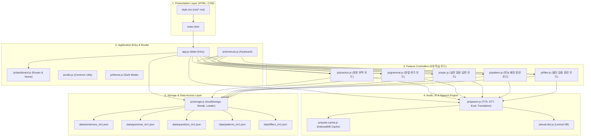

# 🗺️ OPIc 학습 웹 앱 - 코드 맵 (Code Map)

본 문서는 OPIc IM1 대비 **한→영 문장 변환 연습, 문법 포인트 퀴즈, 실전 질문 답변, 만능 패턴 및 필러 집중 훈련 웹 애플리케이션**의 전체 구조, 파일별 역할, 데이터 흐름 및 아키텍처를 정리한 코드 맵입니다. (GitHub Pages 정적 호스팅 최적화)

---

## 📁 1. 전체 디렉터리 구조 (Directory Tree)

```
OPIc/
├── index.html                  # [View] 메인 HTML 마크업 (화면 컨테이너 및 모듈 로드)
├── style.css                   # [Style] 메인 통합 스타일시트 (@import 모듈 번들러)
├── app.js                      # [Main] 메인 진입점 (이벤트 리스너 등록 & 앱 초기화)
├── CODEMAP.md                  # [Doc] 전체 코드 구조 및 아키텍처 맵
│
├── data/                       # ── [Data Layer - Zero-Latency JS Data Modules] ───
│   ├── sentences_im1.js        # OPIc IM1 문장 번역 데이터 모듈 (208개 문항)
│   ├── grammar_im1.js          # OPIc IM1 문법 포인트 퀴즈 데이터 모듈 (81개 문항)
│   ├── questions_im1.js        # OPIc 실전 질문 및 IM1 만능 답변 데이터 (정규화 & 자동 합성)
│   ├── patterns_im1.js         # 6대 만능 템플릿 및 실시간 슬롯 스위처 데이터 모듈
│   └── fillers_im1.js          # 16개 핵심 필러 및 상황별 가이드 데이터 모듈
├── js/                         # ── [Logic & Controller Layer] ────────────
│   ├── utils.js                # [NEW] 공통 유틸리티 (HTML 이스케이프, 클립보드 복사, 사이드 팝업, 텍스트에어리어 리사이즈)
│   ├── theme.js                # [NEW] 🌙 다크 테마 / 라이트 테마 전담 관리 모듈
│   ├── audio-cache.js          # IndexedDB 기반 TTS 오디오 영구 캐시 매니저 (LRU 자동 정리 지원)
│   ├── eval-dict.js            # OPIc 발음/발화 다면 평가용 토픽 어휘 맵 및 담화 표지어 사전
│   ├── storage.js              # 스토리지(localStorage), JSON 비동기 로딩, 데이터 전체 백업/복원
│   ├── speech.js               # Azure Neural TTS / Google / Web Speech 하이브리드 음성 엔진, 발음 평가
│   ├── dashboard.js            # DOM 엘리먼트 캐시, 홈 대시보드 통계/차트, SPA 라우터
│   ├── practice.js             # 문장 번역 연습 모드 (도트 반응형 축약, 이전 답변 복원, 채점, 저장)
│   ├── grammar.js              # 문법 포인트 퀴즈 모드 (도트 반응형 축약, 보기 선택, 해설, 저장)
│   ├── opic.js                 # OPIc 실전 질문 답변 모드 (이전 답변 복원, 에바 질문, 분할 뷰, 타이머)
│   ├── pattern.js              # 만능 패턴 집중 훈련 모드 컨트롤러 (슬롯 스위처, 단계별 TTS/STT)
│   ├── filler.js               # [NEW] 16개 핵심 필러 1개씩 집중 훈련 컨트롤러 (타이밍 가이드, 실전 예문)
│   ├── speech-practice.js      # [NEW] 🗣️ 발화 연습 컨트롤러 (자유 발화 입력, 마이크 녹음, 녹음본 청취, 채점)
│   ├── vocab-tooltip.js        # 인라인 번역 툴팁 및 📚 내 단어장 모달/복습 관리 시스템
│   └── shortcuts.js            # 맥북/PC 데스크톱 키보드 단축키 핸들러
│
└── css/                        # ── [Design System & Style Layer] ─────────
    ├── base.css                # 디자인 토큰(CSS 변수), 🌙 다크 테마, 리셋, 모바일 반응형 미디어 쿼리
    ├── buttons.css             # 통합 버튼 시스템 (Tier 1~5, 칩, 단축키 배지, 펄스 애니메이션)
    ├── dashboard.css           # 홈 화면 통계 카드, 7일 학습 막대 차트, 주제 선택 그룹 카드
    ├── practice.css            # 문장 연습 입력창, 마이크, 모범답안, 일치도 평가, 문법 검사 박스
    ├── grammar.css             # 문법 퀴즈 보기 옵션 카드, 번호 배지, 해설 박스
    ├── opic.css                # OPIc 실전 질문 답변 연습 카드 및 분할 뷰 스타일
    ├── pattern.css             # 만능 패턴 집중 훈련 카드 및 슬롯 스위처 스타일
    ├── filler.css              # [NEW] 필러 집중 훈련 카드 및 타이밍 칩 스타일
    ├── speech-practice.css     # [NEW] 🗣️ 발화 연습 화면 스타일 (녹음본 플레이어, 채점 결과 박스)
    └── vocab-tooltip.css       # 플로팅 번역 툴팁 및 📚 내 단어장 모달 스타일
```

---

## 🏗️ 2. 아키텍처 계층 다이어그램 (Architecture Overview)



---

## 📄 3. 파일별 상세 레퍼런스 (File Reference)

### 🔹 js/utils.js [NEW]

- **역할**: 전역 공통 텍스트 변환, 클립보드 복사, 팝업 및 UI 헬퍼
- **주요 함수**:
  - `escapeHtml(str)`: XSS 방어 및 특수문자 이스케이프
  - `copyText(text, btn)` / `fallbackCopy(text, btn)`: 클립보드 복사 및 완료 배지 토글
  - `openSidePopup(url, title)`: PC/맥북 우측 보조 창 팝업
  - `autoResizeTextarea(el)`: 입력 텍스트 높이 실시간 반응형 자동 확장

### 🔹 js/theme.js [NEW]

- **역할**: 다크 테마 / 라이트 테마 전담 관리
- **주요 함수**:
  - `initTheme()`: 시스템 OS 설정 감지 및 로컬스토리지 저장값 적용
  - `applyTheme(isDark)`: `.dark-theme` 클래스 토글 및 버튼 이모지 업데이트
  - `toggleTheme()`: 사용자 테마 전환 및 저장

### 🔹 js/filler.js [NEW]

- **역할**: 16개 핵심 OPIc 필러(Filler Words) 집중 훈련 컨트롤러
- **주요 함수**:
  - `loadFillerProgress()`, `saveFillerProgress()`: 필러 학습 마스터 상태 저장
  - `renderFillerCard()`: 현재 필러의 사용 시점, 꿀팁, 실전 예문 렌더링
  - `showFillerScreen(targetIdx)`: 특정 필러 카드 화면 표시
  - 마이크를 통한 필러 발음 인식 및 즉각 피드백

### 🔹 js/storage.js

- **역할**: 브라우저 로컬 스토리지 관리, JSON 데이터 비동기 페치 및 학습 통계 계산
- **주요 상태 및 함수**:
  - `storage`: `get()`, `set()`, `delete()`, `list()` 비동기 래퍼
  - `loadData()`: 5대 JSON 데이터 파일 동시 비동기 로딩 (`Promise.all`)
  - `exportAllDataJson()`, `importDataJson(file)`: 학습 데이터 전체 백업 및 복원
  - `logPracticeEvent()`: 일별 학습 횟수 로깅
  - `computeStreak()`: 연속 학습 일수 산출
  - `last7Days()`: 최근 7일 학습 차트 데이터 반환

### 🔹 js/speech.js

- **역할**: 하이브리드 TTS, Web Speech STT, 발음 일치도 및 OPIc 다면 평가
- **주요 함수**:
  - `initTTS()`, `speakText(text, lang, btn)`, `stopTTS()`: 오디오/Web Speech TTS 제어 및 메모리 해제
  - `playAudioBlob(blob, btn, reqId)`: 오디오 재생 및 Blob URL 해제 관리
  - `initSpeechRecognition()`: 실시간 STT 및 마이크 입력
  - `evaluateTopicRelevance()`, `calculateComprehensiveOpicScore()`: OPIc 토픽 적합성 및 종합 점수 산출
  - `checkGrammar(text)`, `translateToKorean(text)`: 실시간 문법 검사 및 번역

### 🔹 js/dashboard.js

- **역할**: DOM 엘리먼트 캐싱, SPA 브라우저 히스토리 라우팅 및 대시보드 렌더링
- **주요 함수**:
  - `els`: 주요 DOM 엘리먼트 캐시
  - `hideAllScreens()`: `.app-screen` 공통 컨테이너 일괄 은닉 및 오디오/마이크 리셋
  - `navigateTo(screen, params)`: SPA 뒤로가기/앞으로가기 완벽 지원 라우터
  - `showHomeScreen()`, `showTopicScreen()`, `showWordTopicScreen()`, `showOpicTopicScreen()`, `showPatternTopics()`, `showFillerScreen()`

---

## 🌐 4. GitHub Pages 배포 시 유의사항 (Deployment Guide)

1. **상대 경로 유지**: 정적 리소스(CSS, JS, JSON 데이터)는 항상 상대 경로(`css/...`, `js/...`, `data/...`)를 사용하여 저장소 이름(`https://<user>.github.io/<repo>/`)이 서브경로로 붙어도 404가 발생하지 않도록 유지합니다.
2. **무빌드(Zero-Build) 정적 호스팅**: Webpack/Vite 등의 번들러가 필요 없는 순수 바닐라 환경이므로 `main` 브랜치에 푸시하는 즉시 GitHub Pages에 반영됩니다.
3. **HTTPS & CORS 준수**: 브라우저 보안 정책에 따라 모든 외부 API 호출(Azure, CDN, 구글 번역)은 HTTPS 엔드포인트를 유지합니다.
