# 🗺️ OPIc 학습 웹 앱 - 코드 맵 (Code Map)

본 문서는 OPIc IM1 대비 **한→영 문장 변환 연습, 문법 포인트 퀴즈, 실전 질문 답변, 만능 패턴, 필러 집중 훈련, 발화 연습 웹 애플리케이션**의 전체 구조, 파일별 역할, 데이터 흐름, 크로스 플랫폼 최적화 및 아키텍처를 정리한 종합 레퍼런스입니다. (GitHub Pages 정적 호스팅 최적화)

---

## 📁 1. 전체 디렉터리 구조 (Directory Tree)

```
OPIc/
├── index.html                  # [View] 메인 슬림 HTML5 마크업 (슬롯 컨테이너 & 템플릿 로더 진입점)
├── style.css                   # [Style] 메인 통합 스타일시트 (@import 모듈 번들러)
├── app.js                      # [Main] 메인 진입점 (이벤트 리스너 등록 & 6대 모드 앱 라이프사이클 초기화)
├── CODEMAP.md                  # [Doc] 전체 코드 구조 및 아키텍처 맵
│
├── templates/                  # ── [View Layer - Modular HTML5 Templates] ────────
│   ├── home.html               # 1. 홈 대시보드 화면 조각 (통계, 7일 차트, 모드 선택 카드)
│   ├── practice.html           # 2. 문장 번역 연습 화면 조각 (주제선택 + 카드 + 완료)
│   ├── grammar.html            # 3. 문법 포인트 퀴즈 화면 조각 (주제선택 + 퀴즈 + 완료)
│   ├── opic.html               # 4. OPIc 실전 질문&답변 화면 조각 (주제선택 + 에바 + 완료)
│   ├── pattern.html            # 5. 만능 패턴 집중 훈련 화면 조각 (주제선택 + 패턴 슬롯)
│   ├── filler.html             # 6. 필러 집중 훈련 화면 조각 (16대 필러)
│   ├── speech.html             # 7. 자유 발화 연습 화면 조각 (Whisper AI 마이크 + 다면 진단)
│   ├── modals.html             # 8. 공통 모달 조각 (음성/TTS 설정 모달 + 📚 단어장 모달)
│   └── components/             # ── [Reusable UI Components] ─────────────────────
│       └── voice-input.html    # 공통 음성 입력창 컴포넌트 (마이크, 실시간 번역, 복사 버튼)
│
├── data/                       # ── [Data Layer - Zero-Latency JS Data Modules] ───
│   ├── sentences_im1.js        # OPIc IM1 문장 번역 데이터 모듈 (208개 엄선 문항)
│   ├── grammar_im1.js          # OPIc IM1 문법 포인트 퀴즈 데이터 모듈 (81개 핵심 문법 문항)
│   ├── questions_im1.js        # OPIc 실전 질문 및 IM1 만능 답변 데이터 (정규화 & 자동 합성)
│   ├── patterns_im1.js         # 6대 만능 템플릿 및 실시간 슬롯 스위처 데이터 모듈
│   └── fillers_im1.js          # 16개 핵심 필러 및 상황별 가이드 데이터 모듈
│
├── js/                         # ── [Logic & Controller Layer] ────────────
│   ├── template-loader.js      # 🚀 8대 템플릿 병렬 비동기 주입 및 컴포넌트 확장 로더
│   ├── utils.js                # 공통 유틸리티 (XSS 방어, 클립보드 복사, 보조 팝업, 텍스트에어리어 자동 리사이즈)
│   ├── theme.js                # 🌙 다크 테마 / ☀️ 라이트 테마 전담 관리 모듈 (OS 설정 감지 및 전환)
│   ├── audio-cache.js          # IndexedDB 기반 TTS 오디오 영구 캐시 매니저 (LRU 자동 정리 지원)
│   ├── eval-dict.js            # OPIc 발음/발화 다면 평가용 토픽 어휘 맵 및 담화 표지어 사전
│   ├── storage.js              # 스토리지(localStorage), 데이터 전체 백업/복원(JSON), 스트릭 통계
│   ├── speech.js               # Azure Neural TTS / Google / Web Speech 하이브리드 음성 엔진, 다면 발화 평가
│   ├── dashboard.js            # DOM 엘리먼트 캐시(els), 홈 대시보드 통계/차트, SPA 라우터(navigateTo)
│   ├── practice.js             # [모드 1] 한→영 문장 번역 연습 (도트 네비, 이전 답변 복원, 채점, 단어장 연동)
│   ├── grammar.js              # [모드 2] 문법 포인트 퀴즈 (보기 선택, 즉각 해설, 북마크, 저장)
│   ├── opic.js                 # [모드 3] OPIc 실전 질문 답변 (에바 질문 음성, 3분 타이머, 6문장 분할 뷰)
│   ├── pattern.js              # [모드 4] 만능 패턴 집중 훈련 (슬롯 실시간 교체, 단계별 TTS/STT, 문장 분할)
│   ├── filler.js               # [모드 5] 16개 핵심 필러 훈련 (타이밍 칩, 원어민 발음, 실전 예문)
│   ├── speech-practice.js      # [모드 6] 🗣️ 자유 발화 연습 (마이크 녹음, 오디오 플레이어, 종합 채점)
│   ├── whisper-transcriber.js  # 🤖 온디바이스 Whisper AI WebAssembly/WebGPU 전사 엔진 (@xenova/transformers)
│   ├── vocab-tooltip.js        # 인라인 번역 툴팁 및 📚 내 단어장 모달/복습 관리 시스템
│   └── shortcuts.js            # 맥북/PC 물리 키보드 단축키 핸들러 (한/영 IME 무관 매핑)
│
└── css/                        # ── [Design System & Style Layer] ─────────
    ├── base.css                # 디자인 토큰(CSS 변수), 다크 테마 토큰, 리셋, Safe Area, 모바일 터치 방어
    ├── buttons.css             # 통합 버튼 시스템 (Tier 1~5, 칩, 액션 버튼, 터치 최적화 스타일)
    ├── dashboard.css           # 홈 화면 통계 카드, 7일 학습 막대 차트, 주제 선택 그룹 카드
    ├── practice.css            # 문장 번역 입력창, 마이크 컨트롤러, 모범답안, Diff 평가 박스
    ├── grammar.css             # 문법 퀴즈 옵션 카드, 정오답 하이라이트 배지, 해설 박스
    ├── opic.css                # OPIc 실전 카드, 에바 질문 박스, 타이머 게이지, 6문장 분할 뷰
    ├── pattern.css             # 만능 패턴 카드, 슬롯 교체 칩, 단계별 학습 탭 스타일
    ├── filler.css              # 필러 집중 훈련 카드, 타이밍 칩, 상황별 예문 카드 스타일
    ├── speech-practice.css     # 발화 연습 화면 스타일 (파형 애니메이션, 녹음본 플레이어, 다면 진단표)
    └── vocab-tooltip.css       # 플로팅 번역 툴팁, 📚 내 단어장 모달 및 단어 카드 스타일
```

---

## 🏗️ 2. 아키텍처 계층 다이어그램 (Architecture Overview)

```mermaid
graph TD
    subgraph View ["1. Presentation Layer (HTML / CSS)"]
        HTML["index.html"]
        CSS["style.css (css/*.css 10개 모듈)"]
    end

    subgraph Core ["2. Application Entry & Router"]
        APP["app.js (Main Entry & Initializer)"]
        DASH["js/dashboard.js (Router & DOM Cache)"]
        SHORT["js/shortcuts.js (Cross-Platform Keyboard)"]
        UTILS["js/utils.js (Shared Utilities)"]
        THEME["js/theme.js (Theme Controller)"]
    end

    subgraph Modes ["3. Feature Controllers (6대 학습 모드)"]
        PRAC["js/practice.js (1. 문장 번역 모드)"]
        GRAM["js/grammar.js (2. 문법 퀴즈 모드)"]
        OPIC["js/opic.js (3. 실전 OPIc 모드)"]
        PATT["js/pattern.js (4. 만능 패턴 훈련 모드)"]
        FILL["js/filler.js (5. 필러 훈련 모드)"]
        SP_PRAC["js/speech-practice.js (6. 발화 연습 모드)"]
    end

    subgraph Services ["4. Audio, AI & Lexical Engine"]
        SPEECH["js/speech.js (Azure/Google/Native TTS, STT, 6대 평가)"]
        WHISPER["js/whisper-transcriber.js (온디바이스 Whisper AI)"]
        TOOLTIP["js/vocab-tooltip.js (인라인 번역 & 내 단어장)"]
        CACHE["js/audio-cache.js (IndexedDB Audio Storage)"]
        EVAL_D["js/eval-dict.js (Lexical DB & Discourse Markers)"]
    end

    subgraph Persistence ["5. Storage & Data Layer"]
        STORE["js/storage.js (localStorage Wrapper & Stats)"]
        DATA_S["data/sentences_im1.js (208문항)"]
        DATA_G["data/grammar_im1.js (81문항)"]
        DATA_Q["data/questions_im1.js (실전 질문/답변)"]
        DATA_P["data/patterns_im1.js (6대 패턴)"]
        DATA_F["data/fillers_im1.js (16개 필러)"]
    end

    HTML --> APP
    CSS --> HTML
    APP --> STORE
    APP --> SPEECH
    APP --> DASH
    APP --> TOOLTIP
    APP --> PRAC
    APP --> GRAM
    APP --> OPIC
    APP --> PATT
    APP --> FILL
    APP --> SP_PRAC

    SHORT --> PRAC
    SHORT --> GRAM
    SHORT --> OPIC
    SHORT --> PATT
    SHORT --> FILL
    SHORT --> SP_PRAC

    PRAC --> SPEECH
    PRAC --> STORE
    GRAM --> SPEECH
    GRAM --> STORE
    OPIC --> SPEECH
    OPIC --> STORE
    PATT --> SPEECH
    PATT --> STORE
    FILL --> SPEECH
    FILL --> STORE
    SP_PRAC --> SPEECH
    SP_PRAC --> WHISPER
    SP_PRAC --> STORE

    SPEECH --> CACHE
    SPEECH --> EVAL_D
    TOOLTIP --> SPEECH
    TOOLTIP --> STORE

    STORE --> DATA_S
    STORE --> DATA_G
    STORE --> DATA_Q
    STORE --> DATA_P
    STORE --> DATA_F
```



---

## 📄 3. 모듈별 상세 레퍼런스 (Module Reference)

### 🔹 [Main] app.js

- **역할**: 애플리케이션의 최상위 진입점이자 전역 이벤트 오케스트레이터.
- **주요 기능**:
  - `DOMContentLoaded` 라이프사이클에서 테마(`initTheme`), 음성 엔진(`initSpeechRecognition`), 인라인 툴팁(`initVocabTooltip`), 발화 연습(`initSpeechPractice`), 대시보드(`initDashboard`) 순차적 초기화.
  - 전역 복사 버튼(`copyKo`, `copyEn`, `copyInput`, `copyOpicInput`, `copyPatternInput`) 이벤트 리스너 등록.
  - 모달 오버레이 클릭 시 닫기 핸들러 일괄 바인딩.

### 🔹 [Core] js/dashboard.js

- **역할**: 전체 200여 개 DOM 엘리먼트 캐싱(`els`), 단일 페이지 애플리케이션(SPA) 화면 전환 라우터 및 홈 화면 통계 렌더링.
- **주요 기능**:
  - `els`: 모든 주요 버튼, 카드, 텍스트 요소의 DOM 캐시.
  - `hideAllScreens()`: `.app-screen` 일괄 은닉 및 실행 중인 오디오/마이크/타이머 안전 중지.
  - `navigateTo(screen, params)`: 브라우저 History API(`pushState`, `popstate`) 기반 완벽한 뒤로가기/앞으로가기 지원.
  - `showHomeScreen()`, `showTopicScreen()`, `showWordTopicScreen()`, `showOpicTopicScreen()`, `showPatternTopics()`, `showFillerScreen()`, `showSpeechPracticeScreen()`: 화면별 진입 컨트롤러.

### 🔹 [Core] js/shortcuts.js

- **역할**: 맥북(macOS) 및 윈도우(Windows PC) 데스크톱 환경을 위한 물리 키보드 단축키 시스템.
- **주요 기능**:
  - **한/영 IME 무관 대응**: `e.code`(`KeyP`, `KeyK`, `KeyR`, `KeyG`, `KeyB`, `Space`, `Enter`)와 한글 자모(`ㅔ`, `ㅏ`, `ㄱ`, `ㅎ`, `ㅠ`)를 동시 매핑하여 한글 타이핑 상태에서도 단축키 100% 동작.
  - **운영체제별 조합키**: `Cmd + Enter`(Mac) 및 `Ctrl + Enter`(Windows) 채점 키 동시 지원.
  - **텐키리스 & 넘패드 대응**: `NumpadEnter`, `Numpad1`, `Numpad2` 매핑.
  - 텍스트 입력창 포커스 감지(`isInputFocused`)를 통한 줄바꿈 vs 채점 분기.

### 🔹 [Core] js/utils.js

- **역할**: 전역 공통 텍스트 처리, 클립보드 제어, 팝업 및 UI 헬퍼.
- **주요 기능**:
  - `escapeHtml(str)`: XSS 방지용 HTML 엔티티 이스케이프.
  - `copyText(text, btn)` / `fallbackCopy(text, btn)`: `navigator.clipboard` 우선 및 `execCommand` 폴백 복사, 복사 완료 피드백 배지 토글.
  - `openSidePopup(url, title)`: PC/맥북 보조 모니터/우측 분할 팝업 창 생성.
  - `autoResizeTextarea(el)`: 입력 텍스트 길이에 맞춘 실시간 자동 높이 조절.

### 🔹 [Core] js/theme.js

- **역할**: 🌙 다크 테마 / ☀️ 라이트 테마 전담 관리 모듈.
- **주요 기능**:
  - `initTheme()`: 시스템 `prefers-color-scheme` 감지 및 로컬스토리지 우선 적용.
  - `applyTheme(isDark)`: `body.dark-theme` 토글 및 토글 버튼 아이콘/텍스트 변경.
  - `toggleTheme()`: 사용자 테마 토글 및 저장.

### 🔹 [Audio/AI] js/speech.js

- **역할**: 고품질 음성 합성(TTS), 음성 인식(STT), 실시간 문법 교정, OPIc 공식 기준 6대 영역 다면 발화 평가 시스템.
- **주요 기능**:
  - **3계층 하이브리드 TTS**: Azure Neural Voice (최우선) → Google Translate TTS (경량) → Web Speech API (오프라인 폴백).
  - **오디오 제스처 언락 (`initMobileAudioUnlock`)**: 모바일/iOS Safari의 비동기 오디오 블록 정책 해제를 위한 0.01초 무음 버퍼 사전 활성화.
  - **Azure F0 쿼터 트래커**: 월 5시간 음성 평가 및 50만자 TTS 실시간 사용량 추적.
  - **한국인 음소 왜곡 자동 보정 (`PHONETIC_CORRECTION_RULES`)**: `apartment`, `cafe`, `Buldang-dong` 등 30여 개 빈출 오인식 자동 치환.
  - **지능형 가상 문장 분절기 (`splitIntoVirtualSentences`)**: 구두점 없는 긴 발화 스트림을 담화표지어/접속사 기준으로 분절.
  - **6대 영역 다면 평가 (`calculateComprehensiveOpicScore`)**: 유창성(WPM, 쉼, 필러), 발화량, 주제 적합도, 문법 정확도, 어휘 다양성(TTR), 발음 일치도를 종합하여 예측 등급(AL~NH) 산출.

### 🔹 [Audio/AI] js/whisper-transcriber.js

- **역할**: 브라우저 내장 온디바이스 Whisper AI 음성인식 엔진.
- **주요 기능**:
  - 외부 서버나 API 키 없이 브라우저 WebAssembly/WebGPU 환경에서 `Xenova/whisper-tiny.en` 모델 구동.
  - 녹음된 오디오 Blob을 16kHz Mono Float32Array로 변환 후 실시간 로컬 전사.
  - 최초 1회 브라우저 캐시(약 39MB) 다운로드 후 완전 오프라인 구동 지원.

### 🔹 [Audio/AI] js/audio-cache.js

- **역할**: IndexedDB 기반 TTS 오디오 영구 캐시 매니저.
- **주요 기능**:
  - Azure/Google TTS 오디오 Blob을 IndexedDB에 영구 저장하여 중복 API 호출 방지 및 네트워크 소모 0 구현.
  - LRU(Least Recently Used) 알고리즘 기반 최대 500개 오디오 항목 자동 관리.

### 🔹 [Audio/AI] js/eval-dict.js

- **역할**: OPIc 발음/발화 평가를 위한 어휘 데이터베이스 및 담화 표지어 사전.
- **주요 기능**:
  - 주제별(집, 동네, 카페, 공원, 여행 등) 필수 및 가산점 어휘 사전 정의.
  - 유창성 평가용 접속사, 필러, 전환구 목록 제공.

### 🔹 [Storage] js/storage.js

- **역할**: 로컬 스토리지 추상화, 5대 JS 데이터 모듈 로딩 및 학습 스트릭 통계.
- **주요 기능**:
  - `storage`: `get()`, `set()`, `delete()`, `list()` 로컬스토리지 래퍼.
  - `loadData()`: 5대 데이터 모듈(문장, 문법, OPIc, 패턴, 필러) 메모리 적재 및 동기화.
  - `exportAllDataJson()`, `importDataJson(file)`: 사용자 학습 기록 전체 백업/복원.
  - `logPracticeEvent()`, `computeStreak()`, `last7Days()`: 연속 학습일(Streak) 및 7일 막대 그래프 통계 계산.

### 🔹 [Modes] 6대 학습 컨트롤러

1. **js/practice.js (문장 번역 연습)**:
   - 한글 문장 제시 → 영작 입력(텍스트/음성) → 모범 답안 비교 및 단어 편집 거리 기반 Diff 하이라이트.
   - 208개 문항 도트 네비게이션, 잘함/다시/건너뛰기 상태 저장, 이전 답변 복원.
2. **js/grammar.js (문법 포인트 퀴즈)**:
   - 81개 핵심 문법 4지선다 퀴즈. 보기 선택 즉시 정/오답 판정 및 상세 문법 해설 카드 렌더링.
3. **js/opic.js (실전 질문 답변)**:
   - 실제 OPIc 시험과 동일한 에바(Eva) 질문 음성 청취, 3분 답변 타이머, 6문장 분할 모범 답안 뷰 지원.
4. **js/pattern.js (만능 패턴 집중 훈련)**:
   - 6대 핵심 패턴 템플릿 기반 실시간 슬롯 어휘 교체, 문장별 따라 말하기 즉각 발음 채점.
5. **js/filler.js (필러 집중 훈련)**:
   - 16개 핵심 필러(Um, You know, Actually 등)의 타이밍 가이드, 원어민 발음, 상황별 예문 집중 학습.
6. **js/speech-practice.js (자유 발화 연습)**:
   - 자유 주제 발화 녹음 → 실시간 음성인식(STT) 또는 온디바이스 Whisper AI 전사 → 내 목소리 청취 플레이어 → 종합 다면 평가 보고서 제공.

### 🔹 [Tooltip/Vocab] js/vocab-tooltip.js

- **역할**: 본문 내 영단어 선택 시 즉각적인 인라인 번역 팝업 제공 및 📚 내 단어장 관리.
- **주요 기능**:
  - 더블클릭 또는 드래그 시 단어 뜻/품사/발음기호 툴팁 표시 및 원어민 TTS 발음 재생.
  - 단어장 저장(별표 토글), 단어장 모달을 통한 외운 단어 체크 및 저장 단어 삭제 관리.

---

## 🌐 4. 크로스 플랫폼(Cross-Platform) 호환성 아키텍처

본 앱은 데스크톱과 모바일의 다양한 운영체제와 브라우저 엔진에서 100% 동일한 사용자 경험을 제공하도록 설계되었습니다.

| 대상 환경                                         | 주요 이슈 및 제약 조건                                                                                               | 아키텍처 대응 솔루션                                                                                                                                                                                                               |
| :------------------------------------------------ | :------------------------------------------------------------------------------------------------------------------- | :--------------------------------------------------------------------------------------------------------------------------------------------------------------------------------------------------------------------------------- |
| 🍎 **iOS (iPhone/iPad Safari)**                   | • 사용자 터치 없는 비동기 오디오 재생 차단<br>• MediaRecorder WebM 형식 미지원<br>• 노치/다이나믹 아일랜드 영역 간섭 | • `initMobileAudioUnlock()`: 첫 터치 시 0.01초 무음 버퍼 및 AudioContext 사전 활성화<br>• `MediaRecorder.isTypeSupported`로 `audio/mp4`, `audio/aac` 자동 Fallback<br>• `viewport-fit=cover` 및 `env(safe-area-inset-*)` 여백 처리 |
| 📱 **갤럭시 (Android Chrome / Samsung Internet)** | • STT와 녹음기의 마이크 동시 접근 시 하드웨어 락<br>• 더블탭 확대 간섭 및 300ms 탭 딜레이                            | • `isMobile` 감지 기반 모드별 마이크 단독 점유 분기 처리<br>• `touch-action: manipulation;` 및 `-webkit-tap-highlight-color: transparent;` 전 버튼 적용                                                                            |
| 💻 **맥북 (macOS Safari / Chrome)**               | • 한/영 전환 상태에서 키보드 단축키 미인식<br>• Command(⌘) 키 조합 지원                                              | • `e.code`(`KeyP`, `Space`, `Enter`)와 한글 자모(`ㅔ`, `ㅏ`, `ㄱ`) 동시 검사<br>• `Cmd + Enter` 및 `Ctrl + Enter` 채점 단축키 동시 지원                                                                                            |
| 🖥️ **윈도우 (Windows PC Chrome / Edge)**          | • 숫자 키패드(Numpad) 단축키 미인식<br>• Control 키 조합 지원                                                        | • `NumpadEnter`, `Numpad1`, `Numpad2` 매핑<br>• 데스크톱 브라우저 100% 표준 단축키 제공                                                                                                                                            |

---

## 🚀 5. GitHub Pages 배포 및 유지보수 가이드 (Deployment Guide)

1. **상대 경로 원칙**:
   - 모든 정적 리소스(CSS, JS, 데이터 모듈)는 상대 경로(`css/...`, `js/...`, `data/...`)로 참조하여, 저장소 서브 디렉터리(`https://<username>.github.io/<repo>/`) 배포 시에도 404 없이 즉시 작동합니다.
2. **무빌드(Zero-Build) 정적 호스팅**:
   - Webpack/Vite 등의 복잡한 빌드 파이프라인 없이 순수 바닐라 ES6+ 모듈로 동작하므로 `main` 브랜치에 커밋/푸시하는 즉시 실시간 배포됩니다.
3. **오프라인 및 PWA 친화적 아키텍처**:
   - 브라우저 로컬스토리지와 IndexedDB를 활용하여 네트워크 장애 시에도 이전 학습 기록, 단어장, 오디오 캐시를 보존합니다.
4. **HTTPS 보안 컨텍스트 필수**:
   - 마이크 입력(Web Speech API, MediaRecorder) 및 온디바이스 WebGPU는 브라우저 보안 규정에 따라 HTTPS 환경(GitHub Pages 기본 제공)에서만 구동됩니다.
