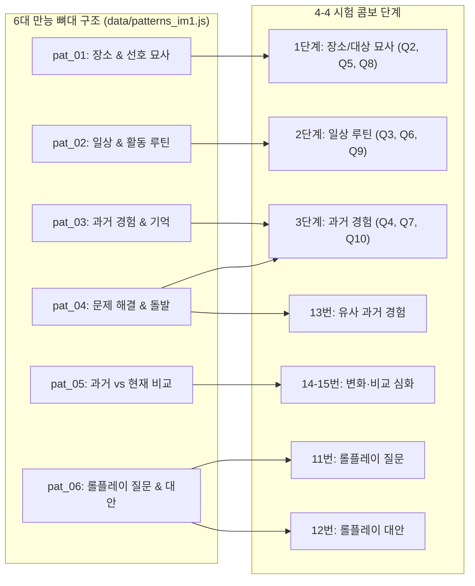

# 🎯 OPIc 난이도 4-4 완벽 대비: 프로젝트 문제 및 뼈대 구조(만능 템플릿) 총정리 매핑

본 문서는 프로젝트 내의 **12개 핵심 주제, 40개 실전 질문 데이터(`data/questions_im1.js`)**를 **난이도 4-4 시험 구성 공식**과 **6대 만능 뼈대 템플릿(`data/patterns_im1.js`)**에 1:1로 정밀 매핑한 종합 레퍼런스입니다.

---

## 📊 1. OPIc 난이도 4-4 출제 구조 & 전략 개요

OPIc 시험에서 **난이도 4-4**를 선택할 경우(1단계 서베이 난이도 4 선택 ➔ 7번 문항 종료 후 중간 점검에서 "비슷한 질문(난이도 4 유지)" 선택), 목표 등급은 주로 **IM1 ~ IM3 및 IH**입니다.

### 📌 15문항 시험 출제 공식 (4-4 Flow)

| 문항 번호 |       문항 성격        |              문제 유형               | 콤보 구성  |         적용 뼈대 구조 (Pattern ID)         |
| :-------: | :--------------------: | :----------------------------------: | :--------: | :-----------------------------------------: |
|  **Q1**   |      공통 워밍업       |             **자기소개**             | 단일 문항  |        `pat_01` (자기소개 맞춤 변형)        |
|  **Q2**   |  세트 1 (서베이/돌발)  |      **1단계: 장소/대상 묘사**       | 3단 콤보 ① |         `pat_01` (장소 & 선호 묘사)         |
|  **Q3**   |  세트 1 (서베이/돌발)  |      **2단계: 일상 루틴·활동**       | 3단 콤보 ② |         `pat_02` (일상 & 활동 루틴)         |
|  **Q4**   |  세트 1 (서베이/돌발)  |      **3단계: 과거 기억·경험**       | 3단 콤보 ③ | `pat_03` (과거 경험) / `pat_04` (돌발 해결) |
|  **Q5**   |  세트 2 (서베이/돌발)  |      **1단계: 장소/대상 묘사**       | 3단 콤보 ① |         `pat_01` (장소 & 선호 묘사)         |
|  **Q6**   |  세트 2 (서베이/돌발)  |      **2단계: 일상 루틴·활동**       | 3단 콤보 ② |         `pat_02` (일상 & 활동 루틴)         |
|  **Q7**   |  세트 2 (서베이/돌발)  |      **3단계: 과거 기억·경험**       | 3단 콤보 ③ | `pat_03` (과거 경험) / `pat_04` (돌발 해결) |
|     —     | **[난이도 중간 점검]** |   _"비슷한 질문"_ 선택 (4-4 유지)    |     —      |                      —                      |
|  **Q8**   |  세트 3 (돌발/서베이)  |      **1단계: 장소/대상 묘사**       | 3단 콤보 ① |         `pat_01` (장소 & 선호 묘사)         |
|  **Q9**   |  세트 3 (돌발/서베이)  |      **2단계: 일상 루틴·활동**       | 3단 콤보 ② |         `pat_02` (일상 & 활동 루틴)         |
|  **Q10**  |  세트 3 (돌발/서베이)  |      **3단계: 과거 기억·경험**       | 3단 콤보 ③ | `pat_03` (과거 경험) / `pat_04` (돌발 해결) |
|  **Q11**  |   세트 4 (롤플레이)    |   **상황 질문·정보 문의 (3~4개)**    | 롤플레이 ① |        `pat_06` (롤플레이 질문 공식)        |
|  **Q12**  |   세트 4 (롤플레이)    | **문제 발생 설명 & 대안 제시 (2개)** | 롤플레이 ② |        `pat_06` (롤플레이 대안 공식)        |
|  **Q13**  |   세트 4 (롤플레이)    |    **유사한 과거 경험/문제 해결**    | 롤플레이 ③ | `pat_04` (돌발 문제) + `pat_03` (과거 경험) |
|  **Q14**  |  세트 5 (고득점 2단)   |      **과거 vs 현재 변화·비교**      | 심화 2단 ① |      `pat_05` (과거 vs 현재 변화/비교)      |
|  **Q15**  |  세트 5 (고득점 2단)   |   **계절별 변화 / 트렌드 / 이슈**    | 심화 2단 ② |   `pat_05` (변화/비교) / `pat_02` (심화)    |

---

## 🧩 2. 프로젝트 6대 만능 뼈대 구조 (Skeleton Overview)

프로젝트 `data/patterns_im1.js`에 정의된 6대 만능 뼈대는 어떤 문제가 나와도 1~2개 핵심 키워드만 바꿔 끼워 즉시 5~6문장의 완성형 답변을 구사할 수 있도록 설계되어 있습니다.



1. **`pat_01` (장소 & 선호 묘사 템플릿)**:
   - **뼈대 흐름**: 최애 장소 선언 ➔ 접근성(집/회사 근처, 5분 거리) ➔ 분위기(깔끔, 조용, 아늑) ➔ 구체적 특징 2가지 ➔ 최고의 장소 강조 ➔ 항상 시간 보냄
2. **`pat_02` (일상 & 활동 루틴 템플릿)**:
   - **뼈대 흐름**: 주기/시간대 제시 ➔ 첫 번째 활동(First) ➔ 메인 활동(Then/Next) ➔ 동시/추가 활동(While/And) ➔ 마무리 휴식(After that) ➔ 소감(마음 편안함)
3. **`pat_03` (과거 경험 & 기억에 남는 일 템플릿)**:
   - **뼈대 흐름**: 경험 시점/장소 계기 ➔ 누구와 무엇을 했는지 ➔ 인상 깊었던 핵심 사건/음악/풍경 ➔ 감정(놀라움/신남) ➔ 잊지 못할 추억
4. **`pat_04` (문제 해결 & 돌발 상황 만능 템플릿)**:
   - **뼈대 흐름**: 평화로운 상황 배경 ➔ 갑작스러운 돌발 문제(Suddenly) ➔ 당황/걱정(worried) ➔ 침착한 대응 조치(calmed down, called/fixed) ➔ 결과 및 안도(great relief)
5. **`pat_05` (과거 vs 현재 변화 & 비교 템플릿)**:
   - **뼈대 흐름**: 과거와 지금의 차이 제시(In the past vs now) ➔ 과거의 상태/불편함 ➔ 현대적 변화/새 기능(modern, clean) ➔ 구체적 예시 ➔ 삶의 힐링/만족
6. **`pat_06` (롤플레이 만능 공식)**:
   - **[11번 질문형]**: 인사/용건 ➔ 질문 1 (시간/날짜) ➔ 질문 2 (가격/티켓) ➔ 질문 3 (예약/할인) ➔ 감사 인사
   - **[12번 대안형]**: 사과 및 비상 상황 설명 ➔ 대안 1 (먼저 시작/주문 요청) ➔ 대안 2 (시간/장소 변경) ➔ 양해 구하기

---

## 📋 3. 프로젝트 주제별 40개 전체 질문 & 뼈대 구조 1:1 매핑 맵

### 1) 자기소개 (Self-Introduction) - 2문항

| ID           | 유형      | 콤보 역할             | 시험 예상 | 질문 내용 (한국어 & 영어)                                                                                                                                               | 추천 뼈대 ID  |
| :----------- | :-------- | :-------------------- | :-------- | :---------------------------------------------------------------------------------------------------------------------------------------------------------------------- | :-----------: |
| `q_intro_01` | 인물 묘사 | 1단계: 장소·대상 묘사 | **Q1**    | **본인에 대해 간단히 소개해 주세요.**<br>`Let's start the interview now. Please tell me a little bit about yourself.`                                                   | `pat_01` 변형 |
| `q_intro_02` | 일상/취미 | 2단계: 일상 루틴·활동 | 추가 질문 | **평소 하루 일과와 주말에 주로 무엇을 하시는지 더 자세히 말씀해 주시겠어요?**<br>`Could you tell me more about your daily routine and what you usually do on weekends?` |   `pat_02`    |

---

### 2) 집/주거 (Home & Living) - 4문항

| ID          | 유형          | 콤보 역할             | 시험 예상   | 질문 내용 (한국어 & 영어)                                                                                                                                                                                                           |  추천 뼈대 ID   |
| :---------- | :------------ | :-------------------- | :---------- | :---------------------------------------------------------------------------------------------------------------------------------------------------------------------------------------------------------------------------------- | :-------------: |
| `q_home_01` | 장소 묘사     | 1단계: 장소·대상 묘사 | Q2/Q5/Q8    | **설문에서 아파트에 거주한다고 하셨습니다. 거주하시는 집에 대해 설명해 주세요. 집이 어떻게 생겼나요?**<br>`You indicated in the survey that you live in an apartment. Please describe your home to me. What does it look like?`     |    `pat_01`     |
| `q_home_02` | 일상 루틴     | 2단계: 일상 루틴·활동 | Q3/Q6/Q9    | **평일과 주말에 집에서 보통 무엇을 하시나요? 집에서의 일상 루틴에 대해 말씀해 주세요.**<br>`What do you normally do at home on weekdays and weekends? Please tell me about your daily routine at home.`                             |    `pat_02`     |
| `q_home_03` | 과거 경험     | 3단계: 과거 기억·경험 | Q4/Q7/Q10   | **물건이 고장 나거나 가전제품이 작동하지 않는 등 집에서 문제를 겪은 적이 있나요? 어떻게 해결하셨나요?**<br>`Have you ever experienced a problem at home, such as something broken or an appliance not working? How did you fix it?` | `pat_04` (돌발) |
| `q_home_04` | 변화/인테리어 | 4단계: 변화·비교 심화 | **Q14/Q15** | **과거와 비교하여 거주하시는 집이 어떻게 달라졌나요? 새로운 가구를 사거나 인테리어를 바꾸신 적이 있나요?**<br>`How has your home changed compared to the past? Did you buy any new furniture or change the interior design?`        |    `pat_05`     |

---

### 3) 직장/업무 (Work & Office) - 4문항

| ID          | 유형         | 콤보 역할             | 시험 예상   | 질문 내용 (한국어 & 영어)                                                                                                                                                                                                                                |    추천 뼈대 ID     |
| :---------- | :----------- | :-------------------- | :---------- | :------------------------------------------------------------------------------------------------------------------------------------------------------------------------------------------------------------------------------------------------------- | :-----------------: |
| `q_work_01` | 장소 묘사    | 1단계: 장소·대상 묘사 | Q2/Q5/Q8    | **직장에 다닌다고 하셨습니다. 다니시는 회사와 근무지에 대해 말씀해 주세요. 어디에 위치해 있고 어떻게 생겼나요?**<br>`You mentioned that you work. Please tell me about your company and your workplace. Where is it located and what does it look like?` |      `pat_01`       |
| `q_work_02` | 일상/루틴    | 2단계: 일상 루틴·활동 | Q3/Q6/Q9    | **직장에서의 일상적인 업무에 대해 말씀해 주세요. 일반적인 근무 시간 동안 어떤 일들을 처리하시나요?**<br>`Please tell me about your daily responsibilities at work. What tasks do you handle on a typical day?`                                           |      `pat_02`       |
| `q_work_03` | 과거 경험    | 3단계: 과거 기억·경험 | Q4/Q7/Q10   | **직장에서 수행했던 기억에 남는 프로젝트나 해결했던 긴급한 문제에 대해 말씀해 주세요. 어떻게 해결하셨나요?**<br>`Tell me about a memorable project or an urgent problem you solved at work. How did you resolve it?`                                     | `pat_04` / `pat_03` |
| `q_work_04` | 첫 출근/비교 | 4단계: 변화·비교 심화 | **Q14/Q15** | **현재 직장에 처음 출근했던 첫날에 대해 말씀해 주세요. 무엇을 하셨고 어떤 기분이 드셨나요?**<br>`Tell me about your very first day at your current company. What did you do and how did you feel?`                                                       | `pat_03` / `pat_05` |

---

### 4) 카페가기 (Cafe) - 4문항

| ID          | 유형        | 콤보 역할             | 시험 예상   | 질문 내용 (한국어 & 영어)                                                                                                                                                                                                                               | 추천 뼈대 ID |
| :---------- | :---------- | :-------------------- | :---------- | :------------------------------------------------------------------------------------------------------------------------------------------------------------------------------------------------------------------------------------------------------ | :----------: |
| `q_cafe_01` | 장소 묘사   | 1단계: 장소·대상 묘사 | Q2/Q5/Q8    | **설문에서 카페 가기를 좋아한다고 하셨습니다. 가장 좋아하시는 카페에 대해 자세히 설명해 주세요. 어떤 모습인가요?**<br>`You indicated in the survey that you like going to cafes. Please describe your favorite cafe in detail. What does it look like?` |   `pat_01`   |
| `q_cafe_02` | 일상 루틴   | 2단계: 일상 루틴·활동 | Q3/Q6/Q9    | **카페에 가면 보통 무엇을 하시나요? 카페에 들어갈 때부터 나올 때까지의 일과를 말씀해 주세요.**<br>`What do you normally do when you go to a cafe? Please tell me about what you do from the moment you enter to the moment you leave.`                  |   `pat_02`   |
| `q_cafe_03` | 과거 경험   | 3단계: 과거 기억·경험 | Q4/Q7/Q10   | **최근 카페에서 겪었던 기억에 남거나 특별했던 경험에 대해 말씀해 주세요. 무슨 일이 있었고 왜 기억에 남나요?**<br>`Tell me about a memorable or special experience you had at a cafe recently. What happened and why was it memorable?`                  |   `pat_03`   |
| `q_cafe_04` | 트렌드/변화 | 4단계: 변화·비교 심화 | **Q14/Q15** | **과거와 비교하여 카페가 어떻게 변화했나요? 예전의 카페 모습과 오늘날 어떻게 달라졌는지 설명해 주세요.**<br>`How have cafes changed compared to the past? Please describe how cafes were before and how they are different today.`                      |   `pat_05`   |

---

### 5) 공원가기 (Park) - 4문항

| ID          | 유형      | 콤보 역할             | 시험 예상   | 질문 내용 (한국어 & 영어)                                                                                                                                                                                                                                                  |    추천 뼈대 ID     |
| :---------- | :-------- | :-------------------- | :---------- | :------------------------------------------------------------------------------------------------------------------------------------------------------------------------------------------------------------------------------------------------------------------------- | :-----------------: |
| `q_park_01` | 장소 묘사 | 1단계: 장소·대상 묘사 | Q2/Q5/Q8    | **설문에서 공원 가기를 좋아한다고 하셨습니다. 자주 가시는 공원에 대해 설명해 주세요. 어디에 있고 어떻게 생겼나요?**<br>`You indicated in the survey that you like going to parks. Please describe a park you often visit. Where is it located and what does it look like?` |      `pat_01`       |
| `q_park_02` | 일상 루틴 | 2단계: 일상 루틴·활동 | Q3/Q6/Q9    | **공원에 가면 보통 무엇을 하시나요? 공원에서의 일반적인 활동 루틴을 처음부터 끝까지 말씀해 주세요.**<br>`What do you usually do when you go to the park? Please tell me about your typical routine at the park from beginning to end.`                                     |      `pat_02`       |
| `q_park_03` | 과거 경험 | 3단계: 과거 기억·경험 | Q4/Q7/Q10   | **공원에서 있었던 기억에 남거나 뜻밖이었던 일에 대해 말씀해 주세요. 무슨 일이 있었고 어떻게 반응하셨나요?**<br>`Tell me about a memorable or unexpected incident that happened to you at a park. What happened and how did you react?`                                     | `pat_03` / `pat_04` |
| `q_park_04` | 계절 변화 | 4단계: 변화·비교 심화 | **Q14/Q15** | **공원은 사계절에 따라 어떻게 변하나요? 계절에 따라 사람들의 활동은 어떻게 달라지나요?**<br>`How does the park change throughout the four seasons? How do people's activities change depending on the season?`                                                             |      `pat_05`       |

---

### 6) 영화보기 (Movies) - 4문항

| ID           | 유형      | 콤보 역할             | 시험 예상   | 질문 내용 (한국어 & 영어)                                                                                                                                                                                                               | 추천 뼈대 ID  |
| :----------- | :-------- | :-------------------- | :---------- | :-------------------------------------------------------------------------------------------------------------------------------------------------------------------------------------------------------------------------------------- | :-----------: |
| `q_movie_01` | 장르/선호 | 1단계: 장소·대상 묘사 | Q2/Q5/Q8    | **설문에서 영화 보기를 좋아한다고 하셨습니다. 어떤 장르의 영화를 좋아하시고, 왜 그 영화들을 좋아하시나요?**<br>`You indicated in the survey that you like watching movies. What types of movies do you like, and why do you like them?` | `pat_01` 변형 |
| `q_movie_03` | 관람 루틴 | 2단계: 일상 루틴·활동 | Q3/Q6/Q9    | **집에서 영화를 볼 때 영화를 보기 전, 보는 중, 보고 난 후에 보통 무엇을 하시는지 말씀해 주세요.**<br>`Please tell me about what you normally do before, during, and after watching a movie at home.`                                    |   `pat_02`    |
| `q_movie_02` | 과거 경험 | 3단계: 과거 기억·경험 | Q4/Q7/Q10   | **최근에 본 가장 기억에 남는 영화에 대해 말씀해 주세요. 줄거리는 무엇이었고 왜 기억에 남았나요?**<br>`Tell me about the most memorable movie you have seen recently. What was the storyline and why was it memorable?`                  |   `pat_03`    |
| `q_movie_04` | 습관 변화 | 4단계: 변화·비교 심화 | **Q14/Q15** | **어릴 적과 비교하여 영화관이나 영화 관람 습관이 어떻게 변화했나요?**<br>`How have movie theaters or movie watching habits changed compared to when you were a child?`                                                                  |   `pat_05`    |

---

### 7) 음악감상 (Music) - 3문항

| ID           | 유형        | 콤보 역할             | 시험 예상 | 질문 내용 (한국어 & 영어)                                                                                                                                                                                                                    | 추천 뼈대 ID  |
| :----------- | :---------- | :-------------------- | :-------- | :------------------------------------------------------------------------------------------------------------------------------------------------------------------------------------------------------------------------------------------- | :-----------: |
| `q_music_01` | 장르/가수   | 1단계: 장소·대상 묘사 | Q2/Q5/Q8  | **설문에서 음악 감상을 좋아한다고 하셨습니다. 어떤 음악을 좋아하시고, 가장 좋아하는 가수는 누구인가요?**<br>`You indicated in the survey that you like listening to music. What kind of music do you like, and who is your favorite singer?` | `pat_01` 변형 |
| `q_music_02` | 청취 루틴   | 2단계: 일상 루틴·활동 | Q3/Q6/Q9  | **언제 어디서 주로 음악을 들으시나요? 음악을 들으면서 무엇을 하시나요?**<br>`When and where do you usually listen to music? What do you do while listening to music?`                                                                        |   `pat_02`    |
| `q_music_03` | 라이브 경험 | 3단계: 과거 기억·경험 | Q4/Q7/Q10 | **콘서트나 거리 등에서 라이브 음악을 들었던 경험에 대해 말씀해 주세요. 어떤 경험이었나요?**<br>`Tell me about a time you heard live music, like at a concert or on the street. What was the experience like?`                                |   `pat_03`    |

---

### 8) 운동하기 / 헬스 (Workout / Gym) - 3문항

| ID              | 유형      | 콤보 역할             | 시험 예상 | 질문 내용 (한국어 & 영어)                                                                                                                                                                                                                      |  추천 뼈대 ID   |
| :-------------- | :-------- | :-------------------- | :-------- | :--------------------------------------------------------------------------------------------------------------------------------------------------------------------------------------------------------------------------------------------- | :-------------: |
| `q_exercise_02` | 장소 묘사 | 1단계: 장소·대상 묘사 | Q2/Q5/Q8  | **설문에서 운동하기를 좋아한다고 하셨습니다. 다니시는 헬스장에 대해 설명해 주세요. 어떤 모습인가요?**<br>`You indicated in the survey that you like working out. Please describe the gym or fitness center you go to. What does it look like?` |    `pat_01`     |
| `q_exercise_01` | 운동 루틴 | 2단계: 일상 루틴·활동 | Q3/Q6/Q9  | **일반적인 운동 루틴에 대해 말씀해 주세요. 처음부터 끝까지 어떤 운동을 하시나요?**<br>`Please describe your typical workout routine. What exercises do you do from start to finish?`                                                           |    `pat_02`     |
| `q_exercise_03` | 부상/돌발 | 3단계: 과거 기억·경험 | Q4/Q7/Q10 | **운동 중 부상을 입거나 예상치 못한 문제를 겪은 적이 있나요? 무슨 일이 있었고 어떻게 대처하셨나요?**<br>`Have you ever experienced an injury or an unexpected problem while exercising? What happened and how did you handle it?`              | `pat_04` (돌발) |

---

### 9) 요리하기 (Cooking) - 3문항

| ID          | 유형        | 콤보 역할             | 시험 예상 | 질문 내용 (한국어 & 영어)                                                                                                                                                                                                                        |  추천 뼈대 ID   |
| :---------- | :---------- | :-------------------- | :-------- | :----------------------------------------------------------------------------------------------------------------------------------------------------------------------------------------------------------------------------------------------- | :-------------: |
| `q_cook_01` | 요리 루틴   | 2단계: 일상 루틴·활동 | Q2/Q5/Q8  | **설문에서 요리하기를 좋아한다고 하셨습니다. 평소 무엇을 요리하시는지 요리 과정을 단계별로 설명해 주세요.**<br>`You indicated in the survey that you like cooking. Please describe what you usually cook and your cooking routine step by step.` |    `pat_02`     |
| `q_cook_02` | 특별한 요리 | 3단계: 과거 기억·경험 | Q3/Q6/Q9  | **특별한 사람을 위해 요리했던 기억에 남는 식사에 대해 말씀해 주세요. 어떤 요리를 만들었고 상대방의 반응은 어땠나요?**<br>`Tell me about a memorable meal you cooked for someone special. What dish did you make, and how did they react?`        |    `pat_03`     |
| `q_cook_03` | 돌발 사고   | 3단계: 과거 기억·경험 | Q4/Q7/Q10 | **요리 중에 예상치 못한 문제나 실수를 겪은 적이 있나요? 무슨 일이 있었고 어떻게 해결하셨나요?**<br>`Have you ever experienced an unexpected problem or accident while cooking? What happened and how did you resolve it?`                        | `pat_04` (돌발) |

---

### 10) 국내여행 (Domestic Trip) - 3문항

| ID          | 유형        | 콤보 역할             | 시험 예상 | 질문 내용 (한국어 & 영어)                                                                                                                                                                                                                                  | 추천 뼈대 ID |
| :---------- | :---------- | :-------------------- | :-------- | :--------------------------------------------------------------------------------------------------------------------------------------------------------------------------------------------------------------------------------------------------------- | :----------: |
| `q_trip_02` | 여행지 묘사 | 1단계: 장소·대상 묘사 | Q2/Q5/Q8  | **설문에서 국내 여행을 좋아한다고 하셨습니다. 가장 좋아하시는 여행지나 드라이브 코스에 대해 설명해 주세요.**<br>`You indicated in the survey that you enjoy traveling in your country. Please describe your favorite travel destination or driving route.` |   `pat_01`   |
| `q_trip_01` | 준비/짐싸기 | 2단계: 일상 루틴·활동 | Q3/Q6/Q9  | **여행을 떠나기 전 보통 무엇을 하시나요? 여행 준비와 짐 싸기는 어떻게 하시나요?**<br>`What do you usually do before going on a trip? How do you prepare and pack your luggage?`                                                                            |   `pat_02`   |
| `q_trip_03` | 최근 여행   | 3단계: 과거 기억·경험 | Q4/Q7/Q10 | **최근에 다녀온 기억에 남는 국내 여행에 대해 말씀해 주세요. 어디로 가셨고 왜 기억에 남나요?**<br>`Tell me about a memorable domestic trip you took recently. Where did you go and why was it so memorable?`                                                |   `pat_03`   |

---

### 11) 캠핑하기 (Camping) - 3문항

| ID          | 유형        | 콤보 역할             | 시험 예상 | 질문 내용 (한국어 & 영어)                                                                                                                                                                                                                                               |  추천 뼈대 ID   |
| :---------- | :---------- | :-------------------- | :-------- | :---------------------------------------------------------------------------------------------------------------------------------------------------------------------------------------------------------------------------------------------------------------------- | :-------------: |
| `q_camp_02` | 캠핑장 묘사 | 1단계: 장소·대상 묘사 | Q2/Q5/Q8  | **설문에서 캠핑 가기를 좋아한다고 하셨습니다. 가장 좋아하시는 캠핑장에 대해 설명해 주세요. 어디에 있고 어떻게 생겼나요?**<br>`You indicated in the survey that you like going camping. Please describe your favorite campsite. Where is it and what does it look like?` |    `pat_01`     |
| `q_camp_01` | 캠핑 루틴   | 2단계: 일상 루틴·활동 | Q3/Q6/Q9  | **캠핑을 가면 보통 무엇을 하시나요? 도착했을 때부터 짐을 정리할 때까지의 일반적인 캠핑 일과를 설명해 주세요.**<br>`What do you usually do when you go camping? Please describe your typical camping routine from the moment you arrive to when you pack up.`            |    `pat_02`     |
| `q_camp_03` | 돌발 사고   | 3단계: 과거 기억·경험 | Q4/Q7/Q10 | **캠핑 중에 발생했던 기억에 남거나 예상치 못했던 사건에 대해 말씀해 주세요. 어떻게 대처하셨나요?**<br>`Tell me about a memorable or unexpected incident that happened while you were camping. How did you deal with it?`                                                | `pat_04` (돌발) |

---

### 12) 롤플레이 (Role-Play: 11번 ~ 13번 전용) - 3문항

| ID        | 유형      | 콤보 역할            | 시험 고정 | 질문 내용 (한국어 & 영어)                                                                                                                                                                                                                                                                                                                                 |    추천 뼈대 ID     |
| :-------- | :-------- | :------------------- | :-------: | :-------------------------------------------------------------------------------------------------------------------------------------------------------------------------------------------------------------------------------------------------------------------------------------------------------------------------------------------------------- | :-----------------: |
| `q_rp_01` | 정보 문의 | 11번: 상황 질문·문의 |  **Q11**  | **친구와 함께 콘서트나 축제에 가려고 티켓을 구매하려 합니다. 매표소에 전화해 행사와 관련된 질문 3~4가지를 해보세요.**<br>`You want to buy tickets for a concert or festival with your friend. Call the ticket box office and ask three or four questions about the event.`                                                                                |  `pat_06` (질문형)  |
| `q_rp_02` | 문제 해결 | 12번: 문제 해결·대안 |  **Q12**  | **친구와 카페에서 만나기로 약속했으나 늦어지고 있습니다. 친구에게 전화해 상황을 설명하고 2가지 대안을 제시해 보세요.**<br>`You made an appointment to meet a friend at a cafe, but you are running late. Call your friend, explain the situation, and suggest two alternatives.`                                                                          |  `pat_06` (대안형)  |
| `q_rp_03` | 유사 경험 | 13번: 유사 과거 경험 |  **Q13**  | **이전 상황과 유사하게, 공연 티켓을 예매하거나 약속/예약을 할 때 예상치 못한 문제를 겪은 적이 있나요? 무슨 일이 있었고 어떻게 해결하셨는지 자세히 말씀해 주세요.**<br>`Have you ever experienced an unexpected problem related to purchasing tickets or making a reservation, similar to the situation before? What happened and how did you resolve it?` | `pat_04` + `pat_03` |

---

## 🚀 4. 추후 웹 애플리케이션 연동 개발(Architecture Guide) 제안

본 매핑 정보를 기반으로, 향후 웹 앱에서 OPIc 실전 모드(`js/opic.js`, `templates/opic.html`)와 패턴 모드(`js/pattern.js`)를 유기적으로 연결할 수 있습니다:

1. **데이터 필드 확장 (`data/questions_im1.js`)**:
   - 각 질문 객체에 `pattern_id: "pat_01"` 및 `pattern_variation_topic: "카페"` 필드를 추가하여 뼈대와 직접 바인딩.
   ```javascript
   {
     id: "q_cafe_01",
     cat: "카페가기",
     pattern_id: "pat_01",              // 매핑된 만능 뼈대 ID
     pattern_topic: "카페",              // 치환 슬롯 토픽
     // ...
   }
   ```
2. **UI 퀵 링크 버튼 (OPIc 실전 화면 `templates/opic.html`)**:
   - 에바의 질문 카드 하단에 `[💡 이 문제 만능 뼈대 구조 보기]` 버튼 배치.
   - 클릭 시 해당 질문에 맞는 만능 패턴(`pat_01` ~ `pat_06`) 팝업 모달을 띄우거나 패턴 학습 화면으로 딥링크 전환.
3. **모의고사(Mock Exam 4-4) 자동 생성기 구현**:
   - 15문항을 위 '난이도 4-4 출제 공식'에 맞춰 프로젝트 내 12개 주제 중 3개 주제를 랜덤 추출(또는 서베이 선택)하여 실전 15문항 세트를 조립.
